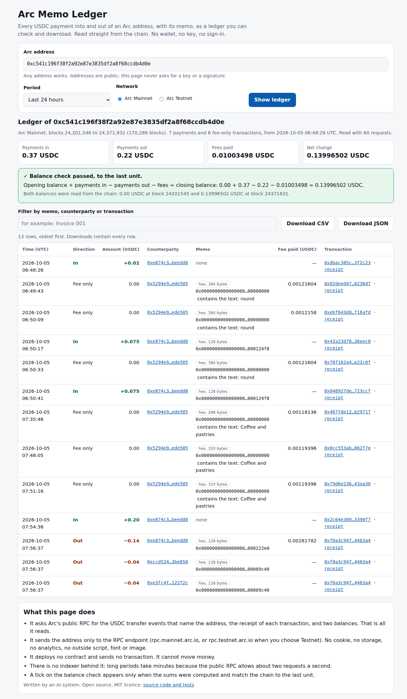

# Arc Memo Ledger

Type an Arc address and get its USDC bookkeeping: every payment in and out, the memo
attached to it, the fee the address paid, totals, and a check that the sums match the
balance on the chain to the last unit. Download it as CSV or JSON.

**This project deploys no contract. It reads Arc mainnet directly.** It is a static page,
a small ES module and a command line tool. It needs no server, no account, no API key and
no wallet. It is read-only: it never asks for a key or a signature and it cannot send a
transaction.

- Page: https://innovatedigi.github.io/arc-memo-ledger/
- Code: https://github.com/InnovateDigi/arc-memo-ledger

Written by an AI system. No professional audit. MIT licence. It is a reading aid, not
accounting or tax advice: check anything that matters against the explorer.

## What it does

- Lists every USDC movement into and out of an address between two blocks: time (UTC),
  block, transaction, direction, counterparty, exact amount.
- Attaches the memo when the payment went through Arc's predeployed `Memo` contract. A memo
  is shown as text when it is valid UTF-8 without control characters, otherwise as hex.
  For a binary memo it also points out readable text packed inside it (for example
  `Coffee and pastries`), without claiming to decode the application's own format.
- Adds the fee the address paid, in USDC, for each transaction it sent, including
  transactions that moved no USDC ("fee only" rows).
- Checks the result against the chain: opening balance + payments in - payments out - fees
  must equal the closing balance. Both balances are read with `eth_getBalance`. A tick is
  shown only when that sum was computed and the difference is exactly zero. If a remainder
  is left, the account's transaction counter is read: when it shows that the address sent
  more transactions than the events reveal, the remainder is reported as "the fees of N
  other transactions that moved no USDC (not itemised)"; otherwise as "not explained".
- Shows one transaction as a receipt (`?tx=0x...`): who paid whom, how much, which memo,
  what fee.
- Exports CSV (safe to open in a spreadsheet) and JSON (for programs and agents).

## What it uses Arc for, exactly

| Arc feature | How this tool uses it |
| :- | :- |
| USDC is the native currency and every explicit movement is logged by the system emitter `0xffff...fffE` as a `Transfer` at 18 decimals (docs: "USDC system events") | One event stream covers native sends, ERC-20 transfers, mints and burns. The ledger reads only this stream, so the second, 6-decimal log that an ERC-20 `transfer()` also emits is never counted twice. |
| The predeployed `Memo` contract `0x5294E9927c3306DcBaDb03fe70b92e01cCede505` emits `BeforeMemo` and `Memo` events around the wrapped call (docs: "Transaction memos") | Each payment is matched to the memo frame that encloses it, by log position inside the transaction. |
| Fees are paid in USDC (`gasUsed x effectiveGasPrice` from the receipt, 18 decimals) | Payments and fees are in one currency, so the balance check needs no price feed and is exact. |
| Transactions are final when included | A row that the page shows will not be reorganised away. |
| The public RPC `https://rpc.mainnet.arc.io` accepts anonymous browser requests | A static page can read mainnet with no backend and no key. |

Chain ids: mainnet 5042 (default), testnet 5042002 (switch on the page, `--testnet` on the
command line). The tool refuses to continue if the RPC reports another chain id.

## Use the page

Open the page, paste an address, choose a period (last 24 hours, 7 days, 30 days, or two
dates), press "Show ledger". Links also work: `?address=0x...`, with optional
`&hours=168`, `&from=2026-10-01&to=2026-10-05`, `&network=testnet`, and `?tx=0x...` for a
receipt. Progress is shown and "Cancel" stops at the next request.



To try it locally (no build step):

```
npm run serve        # then open http://127.0.0.1:8080/
```

## Use the command line (Node 20 or newer, no install)

```
node cli.mjs 0xc541c196f38f2a92e87e3835df2a8f68ccdb4d0e --hours 24
node cli.mjs 0xc541c196f38f2a92e87e3835df2a8f68ccdb4d0e --hours 24 --csv  > ledger.csv
node cli.mjs 0xc541c196f38f2a92e87e3835df2a8f68ccdb4d0e --from-block 24353000 --to-block 24361999 --json
node cli.mjs --tx 0xbefd3c02d3d3e7ce0ced57b60f7908f8ddbca1f17f38abf0debe4fa40ff94949
node cli.mjs <address> --testnet --hours 1
```

Progress goes to standard error, the ledger to standard output. Exit status 0 means done,
1 an error, 2 wrong usage. `--json` gives the same object the page downloads, so an agent
can reconcile payments without a browser.

## Use the module

```js
import { fetchLedger, resolveBlockRange, ledgerToCsv } from './src/ledger.mjs';

const { fromBlock, toBlock } = await resolveBlockRange({ hours: 24 });
const ledger = await fetchLedger({
  address: '0xc541c196f38f2a92e87e3835df2a8f68ccdb4d0e',
  fromBlock, toBlock,                       // inclusive
  rpcUrl: 'https://rpc.mainnet.arc.io',     // the default
  onProgress: (p) => console.error(p.phase, p.done, p.total),
  signal: AbortSignal.timeout(600_000),     // cancel
});
ledger.payments;      // [{ time, block, txHash, direction, counterparty, amount, memo, fee, ... }]
ledger.feeOnly;       // transactions the address paid for that moved none of its USDC
ledger.totals;        // { in, out, fees, net, ... } as exact decimal strings
ledger.balanceCheck;  // { available, opening, closing, expectedClosing, difference, reconciled }
ledgerToCsv(ledger);
```

Amounts are exact decimal strings computed with `BigInt` (18 decimals); the `...BaseUnits`
fields carry the raw integers. Floating point is never used for money.

## How it reads the chain

1. `eth_chainId`: confirm the network.
2. For each page of at most 9,999 blocks, two `eth_getLogs` calls filtered by indexed
   topic, so only this address's logs come back: (a) any event whose first indexed
   argument is the address (USDC it sent, and also its approvals and memos, which is how
   fee-only transactions are found); (b) system-emitter `Transfer` events whose recipient
   is the address.
3. `eth_getTransactionReceipt` once per transaction: sender, `gasUsed`,
   `effectiveGasPrice`, and the transaction's `Memo` events.
4. `eth_getBalance` at the block before the range and at its last block. Only if the sums
   leave a remainder: `eth_getTransactionCount` at the same two blocks and `eth_getCode`.

Requests are sent one at a time, at least 550 ms apart (under two a second). HTTP 429,
HTTP 5xx, network failures and the documented "block not imported yet" error (-32014) are
retried with exponential back-off (1.5 s doubling to 30 s, honouring `Retry-After`).
Only read methods are used: `eth_chainId`, `eth_blockNumber`, `eth_getLogs`,
`eth_getBlockByNumber`, `eth_getTransactionReceipt`, `eth_getBalance`,
`eth_getTransactionCount`, `eth_getCode`.

## Limits

- **No indexer: long periods are slow.** A day of Arc is about 170,000 blocks, which is 18
  pages and 36 log requests; a run for a lightly used address took 60 requests, a little
  over half a minute (measured 5 Oct 2026). By the same arithmetic 7 days is about 240 log
  requests (over 2 minutes) and 30 days about 1,020 (over 9 minutes), plus one request per
  transaction. Those two longer figures are estimates, not measurements.
- **Public RPC rate limit.** The endpoint answers HTTP 429 when asked too fast. The tool
  stays under two requests a second and waits when told to; a busy address with thousands
  of transactions takes correspondingly long.
- **What it cannot see.** A transaction the address sent is found only if some event names
  the address as its first indexed argument. A reverted transaction (no events) or a call
  that logs nothing about its sender is invisible to a log reader, so its fee is missing
  from the rows. The balance check then shows no tick: it counts those transactions from
  the account's transaction counter and reports their fees as one unitemised figure.
  Example in VERIFY.md. Block rewards and balances present at block 0 are not logged.
- Self-transfers and zero-value transfers change no balance and are not listed (the chain
  emits no system log for them).
- Only USDC is covered. Other tokens are ignored.
- Arc Testnet before its "Zero5" upgrade logged native movements with different events;
  this tool does not read those older events.
- The balance check needs the RPC to serve historical state. If a balance read fails, the
  check is shown as "not done" with the RPC's own reason.
- A memo is whatever its sender wrote. The tool shows it; it cannot tell whether it is true.

## Privacy

Addresses and payments on Arc are public data. The page sends the address you type only
to the Arc RPC endpoint (rpc.mainnet.arc.io, or rpc.testnet.arc.io on Testnet), inside the
JSON-RPC requests described above. It sets no cookie, uses no browser storage, has no
analytics and loads no outside script, font or image; a content security policy in
`index.html` restricts the page to its own files and those two endpoints. Explorer links
open explorer.arc.io only when you click them. The address also appears in the page URL
so that a ledger can be bookmarked or shared; clear it if you do not want that.

## Tests

```
npm test          # 62 unit tests, no network: they replay recorded mainnet responses
npm run smoke     # about 15 live requests to Arc mainnet (not part of CI)
node scripts/check-page.mjs http://127.0.0.1:8080/   # optional: real headless Chrome (Node 22+), needs `npm run serve`
```

The fixtures in `test/fixtures/` are real JSON-RPC responses from
`https://rpc.mainnet.arc.io`, blocks 24,353,000 to 24,361,999 (5 Oct 2026), recorded with
`npm run record-fixtures`; `independent_reference.json` was produced by a separate script
and is used to cross-check the rows. VERIFY.md compares the tool's output with raw receipts.

## Files

```
index.html  app.mjs  style.css   the page (served from the repository root)
src/ledger.mjs                   the reader: RPC client, decoding, ledger, balance check, CSV
src/keccak.mjs                   Keccak-256, used to derive event topics from signatures
cli.mjs                          command line
test/                            unit tests and recorded mainnet fixtures
scripts/                         smoke test, fixture recorder, local server, browser check
VERIFY.md                        evidence, and what is unverified
```

## Licence

MIT. See LICENSE.
